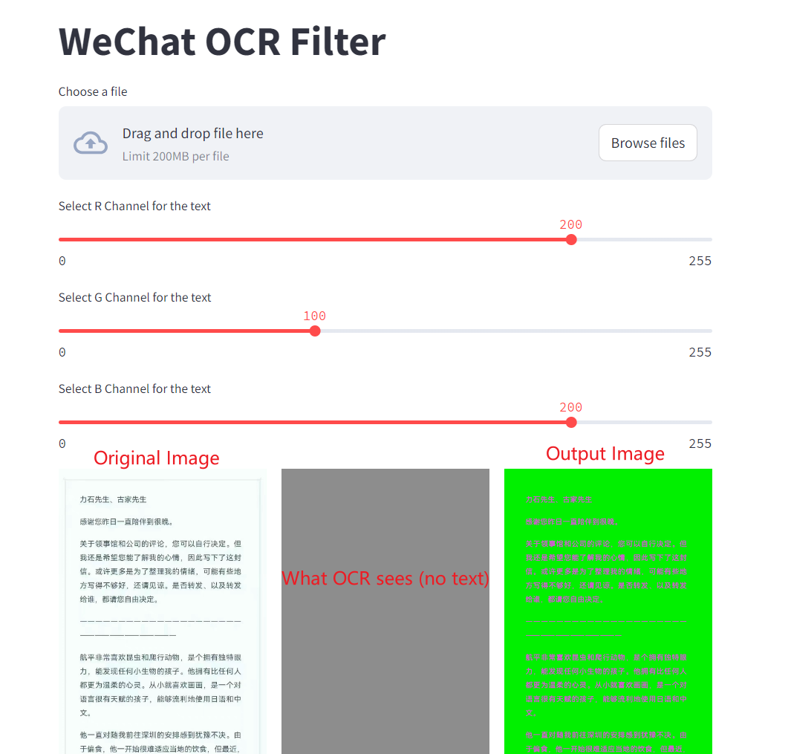

# OCR Evasion (WeChat)

> 告别微信朋友圈的 OCR 审查，处理后图片里的文字不会被识别。

> 注意⚠️：苹果手机 和 微信审查机制 都是用的 luminosity 预处理，
> 但是微信聊天框里的文本识别是另一种算法，所以这个主要是绕过朋友圈的审核。同样，处理后的图片苹果手机也没法复制图片里的文字了。



#### Quick Start

```
$ pip install -r requirements.txt
$ streamlit run streamlit_app.py
  You can now view your Streamlit app in your browser.

  URL: http://127.0.0.1:8501
```

#### Docker Image

```
$ docker run -p 8501:8501 wuhanstudio/ocr-evasion
  You can now view your Streamlit app in your browser.

  URL: http://127.0.0.1:8501
```

Alternatively, you may build the Docker image by yourself.

```
$ docker build -t wuhanstudio/ocr-evasion .
```
